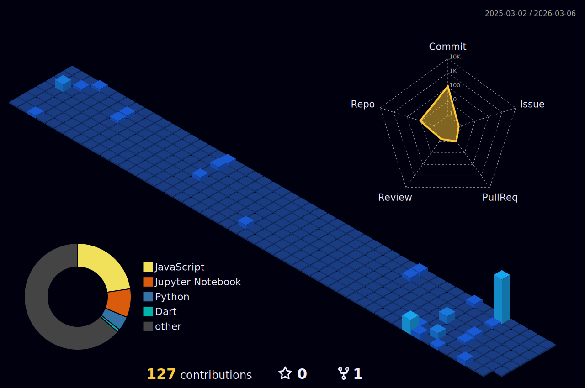

# Hi 👋 I'm Daksh

Welcome to my GitHub profile!

  

<svg viewBox="0 0 900 260" width="100%" xmlns="http://www.w3.org/2000/svg">

  <defs>
    
  </defs>

  <!-- Background -->
  <rect width="100%" height="100%" fill="#0d1117"/>

  <!-- Stars -->
  <g fill="#ffffff">
    <circle cx="120" cy="20" r="1.2" class="star"/>
    <circle cx="300" cy="90" r="1" class="star"/>
    <circle cx="520" cy="40" r="1.3" class="star"/>
    <circle cx="700" cy="130" r="1.1" class="star"/>
    <circle cx="840" cy="60" r="1" class="star"/>
  </g>

  <!-- Enemies (contribution blocks vibe) -->
  <g fill="#2ea043">
    <rect x="200" y="0" width="14" height="14" class="enemy"/>
    <rect x="360" y="0" width="14" height="14" class="enemy"/>
    <rect x="520" y="0" width="14" height="14" class="enemy"/>
    <rect x="680" y="0" width="14" height="14" class="enemy"/>
  </g>

  <!-- Player aircraft -->
  <polygon
    points="450,210 440,235 450,225 460,235"
    fill="#58a6ff"
    class="glow"
  />

  <!-- Bullet -->
  <rect x="447" y="195" width="6" height="16" fill="#ffd33d" class="bullet"/>

  <!-- HUD Text -->
  <text x="50%" y="245" text-anchor="middle"
        fill="#8b949e" font-size="12" font-family="monospace">
    GITHUB ACTIVITY · AIRCRAFT MODE
  </text>

</svg>

