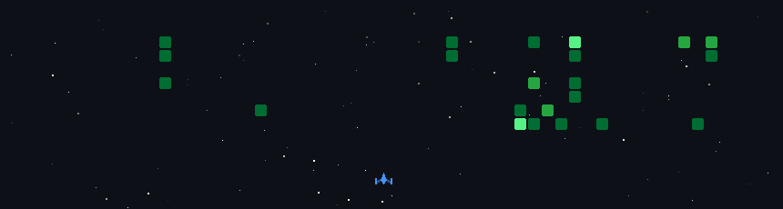

<h1 align="center">Hey 👋, I'm Daksh Goyal!</h1>

  
  
  

---

### 👨‍💻 About Me

I’m a **third-year Computer Science (Data Science) student** from Mumbai who enjoys building **AI/ML systems that solve real-world problems**. I have hands-on experience across the ML pipeline-data preprocessing, model building, evaluation, and deployment-and actively practice **DSA** to strengthen my problem-solving skills. Currently focused on **Machine Learning, NLP, and scalable backend systems**, and looking for impactful **internship opportunities**.

---

### 🛠️ My Tech Stack

  <strong>Programming Languages & Core Concepts:</strong> 
  
  
  
  
  
  
  
  
  
  
  

  <strong>Machine Learning & Data Science:</strong> 
  
  
  
  
  
  
  
  
  
  
  
  
  

  <strong>Developer Tools & Web:</strong> 
  
  
  
  
  
  
  
  
  

---

## 🚀 My GitHub in Action

